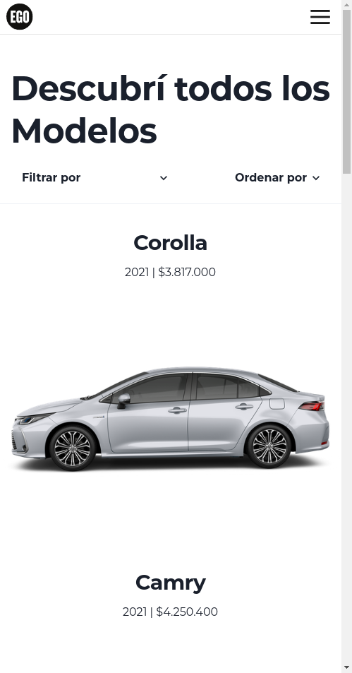

# EGO - Challenge

### Este es un Challenge de desarrollo frontend, realizado para agencia ego.  
Consiste en una aplicación que cuenta con lista de productos y pagina de detalle de producto, incluyendo filtrados y ordenados.

Los productos se obtienen de una API brindada por EGO.

 
 

### Para correr el proyecto localmente usar los siguientes comandos:  
<code>git clone https://github.com/agustinrobledo/ego-challenge.git </code>

<code>cd ego-challenge </code>

<code>npm install </code>

<code>npm run dev </code>

### Para ver el deploy del proyecto visitar el siguiente link: 
<a href="https://ego-challenge-tau.vercel.app"><strong>EGO - Challenge</strong></a> 
